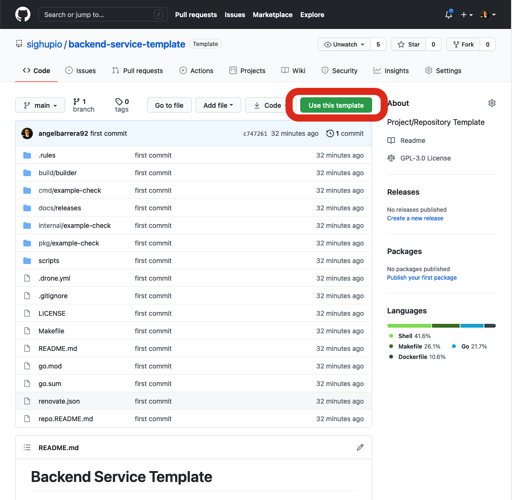
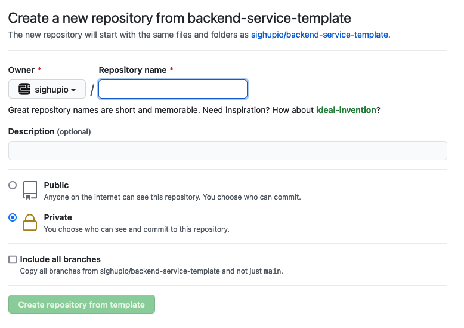
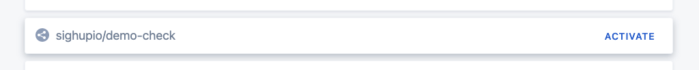
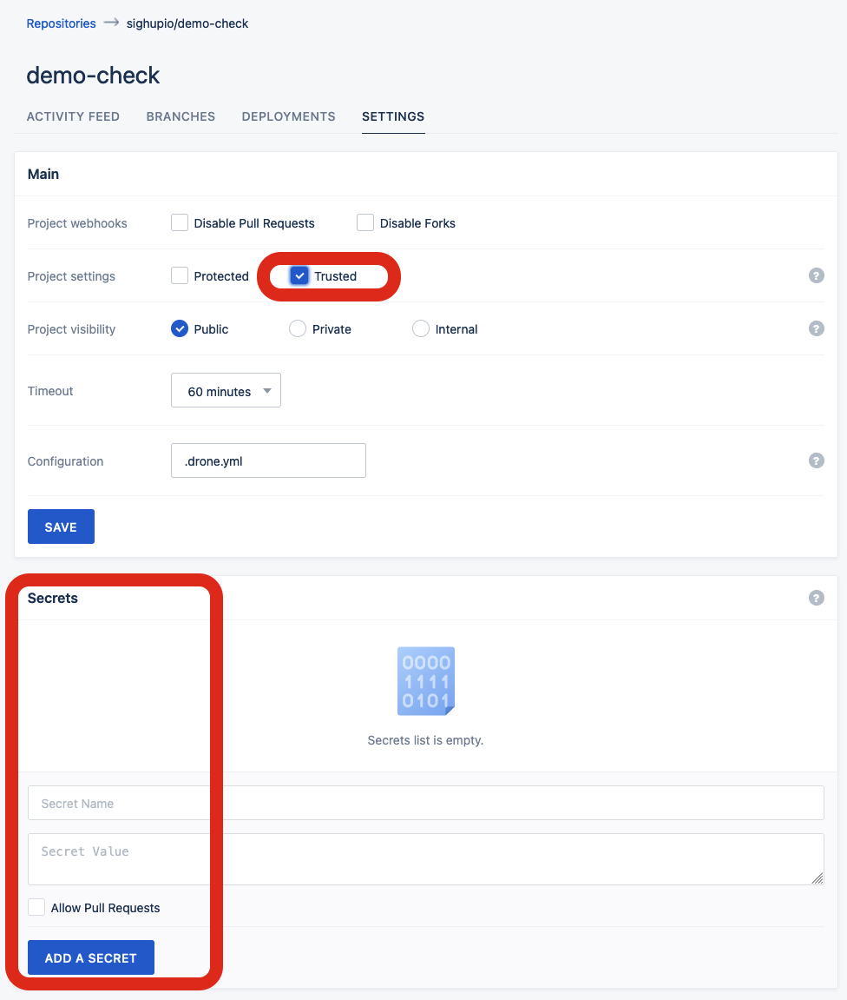
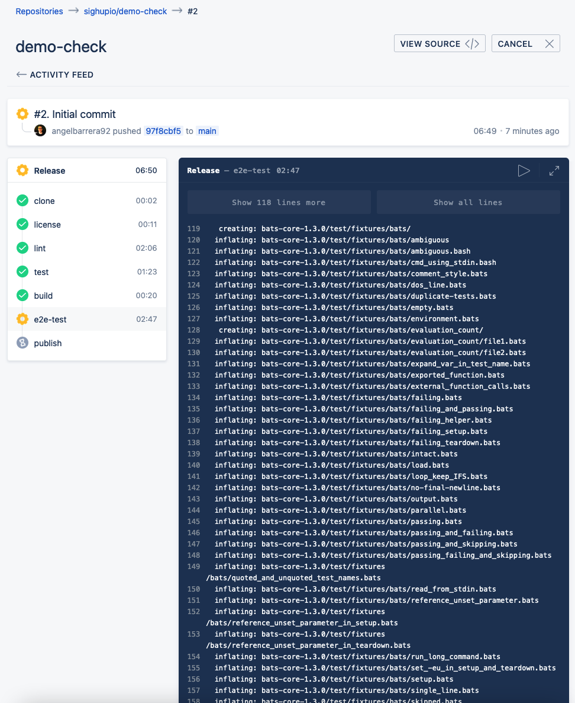

# Fury Intelligent Platform Healthcheck Go Template

This repository is a template repository that you can use to start developing new backend services.

## How To

To start creating a new healthcheck service to perform checks on the cluster, start by clicking the `use this template`
green button in this repository.



Then create a new repository starting from this template:



Then, clone the new repository locally and init it by:

```bash
$ git clone git@github.com:sighupio/demo-check.git
$ cd demo-check/
$ GITHUB_PROJECT=demo-check make init
Initializing repository for demo-check
  Replacing README.md with repo.README.md
  Replacing example-check with demo-check in all the files
  Replacing fip-healthcheck-go-template with demo-check in all the files
  Replacing example-check directories with demo-check in all the dirs
  Removing template docs
  Removing this script
Successfully initialized. Feel free to:

$ git add .
$ git commit --amend -m "Initial commit"
$ git push -f

In order to have a clean repo starting point
```

At this point, you'll have a fully functional golang local environment.

```bash
$ make

 Choose a command to run in fip-healthcheck-go-template:

  init            Init the project. GITHUB_PROJECT=demo make init
  drone-init      Init the drone-project. GITHUB_PROJECT=demo GITHUB_TOKEN=123token321 DRONE_TOKEN=tokenhere REGISTRY=registry.sighup.io REGISTRY_USER=robotuser REGISTRY_PASSWORD=thepassword make drone-init
  build           Build the container image
  lint            Run the policeman over the repository
  build-release   Build the release container image
  test            Run unit testing
  license         Check license headers are in-place in all files in the project
  e2e-test        Execute e2e-tests. CLUSTER_VERSION=v1.21.2 make e2e-test
  publish         Publish the container image
  clean-%         Clean the container image resulting from another target. make build clean-build

```

All these make targets are also available in form of (drone) pipeline.
Ensure you enable the pipeline in drone:



Then ensure you check the `Trusted` checkbox and don't forget to add the following secrets:

- **`REGISTRY`**: Registry endpoint where the resulting container image will be pushed.
Triggered by the `publish` target/pipeline step
- **`REGISTRY_USER`**: User of the `REGISTRY`
- **`REGISTRY_PASSWORD`**: Password for the `REGISTRY_USER` @ `REGISTRY`
- **`GITHUB_TOKEN`**: GitHub personal access token with `public_repo` scope (for public repos),
or `repo` scope (for private repos). This is in charge of publishing a new GitHub release.



Finally, trigger the pipeline by pushing everything to the repository.

```bash
git add .
git commit --amend -m "Initial commit"
git push -f
```



## License

Check [the license file](LICENSE)
